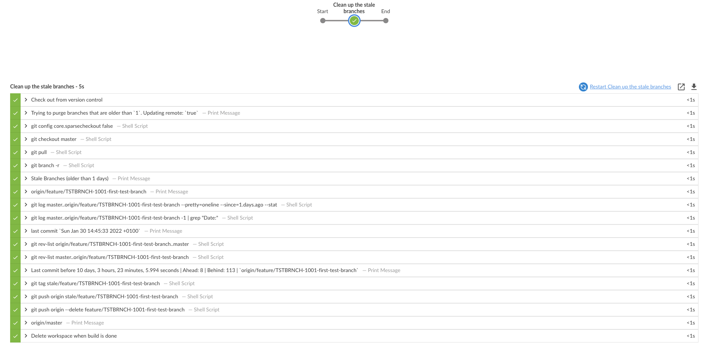

# Stale-Bot

Tags and removes branches older than `x` days.

### How to use

```sh
./gradlew purge
```

Note: It's ignoring master and develop branch by default.

### Options

Either via `gradle.properties`

```groovy
# a branch is stale after x days
days=78
# updates remote, pushing tags and deleting stale branches, default true
updateRemote=true
```

 or via gradle command line arguments

```sh
./gradlew purge -Ddays=78 -DupdateRemote=false
```

[](Screenshot.png)

## Contributors

- [Jan Rabe](https://kibotu.net)
- [Yasar Naci Gündüz](https://github.com/ColdTea-Projects)

### License
<pre>
Copyright 2022 Jan Rabe

Licensed under the Apache License, Version 2.0 (the "License");
you may not use this file except in compliance with the License.
You may obtain a copy of the License at

   http://www.apache.org/licenses/LICENSE-2.0

Unless required by applicable law or agreed to in writing, software
distributed under the License is distributed on an "AS IS" BASIS,
WITHOUT WARRANTIES OR CONDITIONS OF ANY KIND, either express or implied.
See the License for the specific language governing permissions and
limitations under the License.
</pre>
